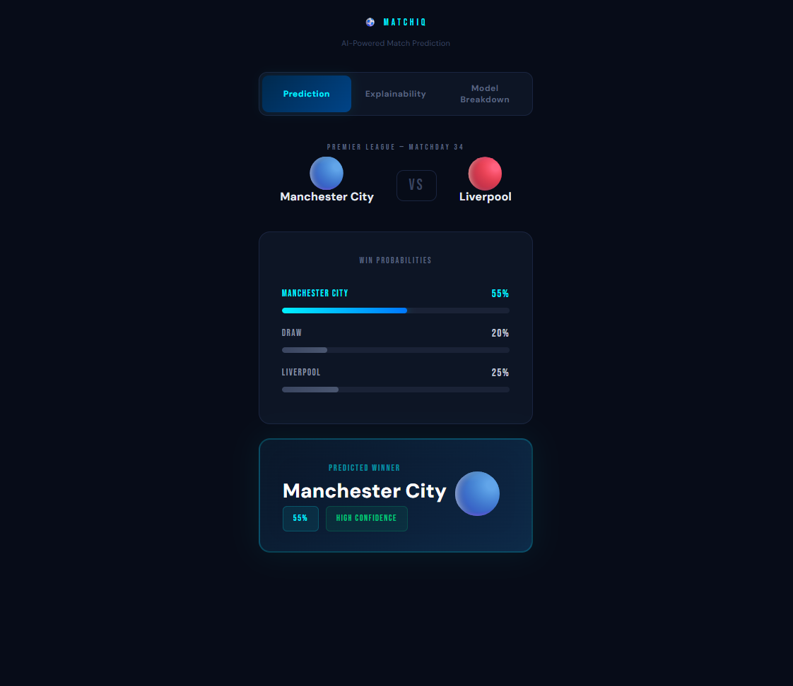
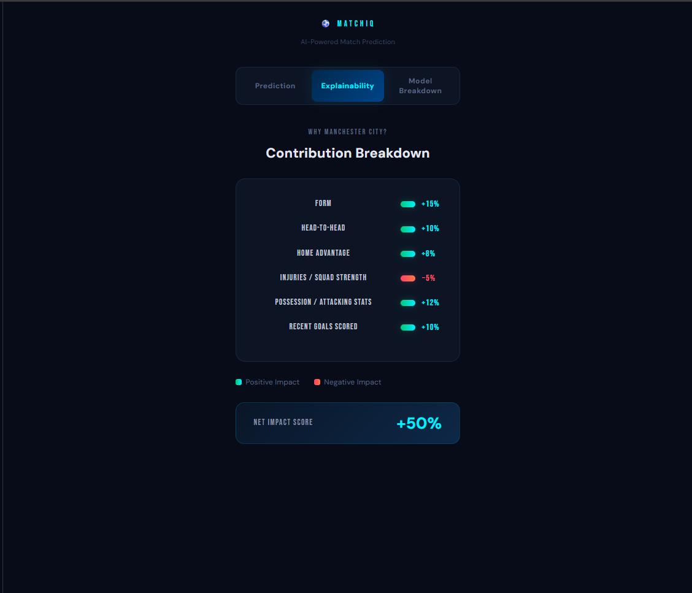
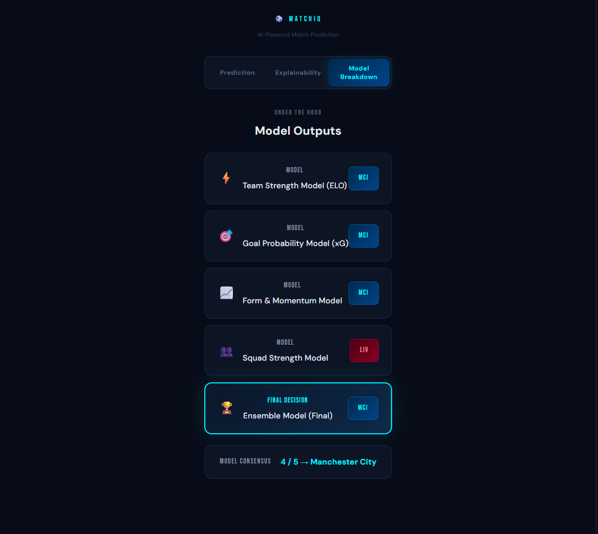

# ⚽ MatchIQ — Football Match Prediction UI

A clean, explainable AI-powered football match prediction interface built using React.

---

## 🚀 Overview

MatchIQ is a frontend demo of a sports analytics system that predicts football match outcomes using multiple models and explainability factors.

This project focuses on:

* Model-driven prediction
* Explainability (why a team wins)
* Clean, modern UI

---

## 🧠 Features

### 📊 Prediction Output

* Match: Manchester City vs Liverpool
* Win probabilities:

  * Manchester City: 55%
  * Draw: 20%
  * Liverpool: 25%
* Final prediction with confidence level

---

### 🔍 Explainability Layer

Breakdown of contributing factors:

* Form
* Head-to-head
* Home advantage
* Injuries / Squad strength
* Possession / Attacking stats
* Recent goals scored

---

### ⚙️ Model Breakdown

* Team Strength Model (ELO)
* Goal Probability Model (xG-inspired)
* Form & Momentum Model
* Squad Strength Model
* Ensemble Model (final decision)

---

## 🛠 Tech Stack

* React (Vite)
* JavaScript
* CSS (inline styling)

---

## 🎯 Purpose

This project demonstrates:

* Frontend system design
* Data-driven UI thinking
* Explainable AI concepts (XAI)

---

## 📸 Demo
### 🔮 Prediction Output

### 🔍 Explainability

### ⚙️ Model Breakdown

---

## 🚧 Future Improvements

* Add real data integration
* Backend model APIs
* Live match updates
* Advanced visualizations

---

## 👨‍💻 Author

Built by [Pinakeshwar Dighe]

